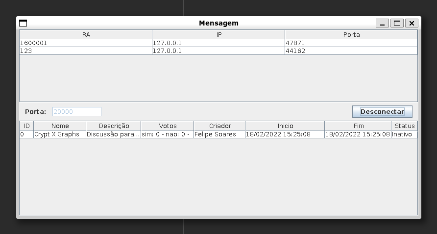
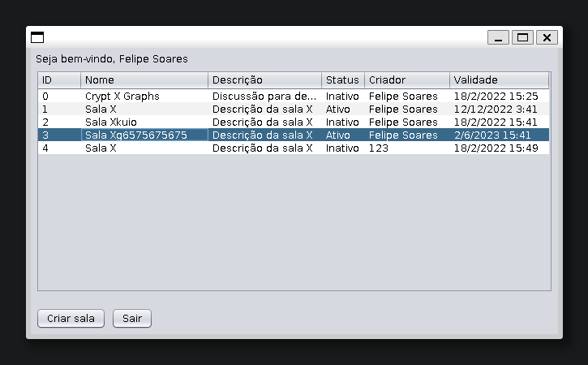

# SistemaVotos

Sistema Votos is a distributed system written in Java. It follows [this](https://github.com/Felipe31/SistemaVotos/blob/master/datagramas.txt)
protocol, written in Portuguese.

It contains a server that holds chat rooms and clients. Each chat room can have options for voting and a due date. The chat is still available after the voting is finished.

The voting is anonymous to other clients, and one can change its vote until the due date. The counting is updated for the server and the clients when one votes.

Any client can create a chat room and set its voting options and due date. There is no restriction to access chat rooms.

Note that the focus of this project is to exercise distributed system concepts. For this reason, it might be missing in security.

##Server

##Client

